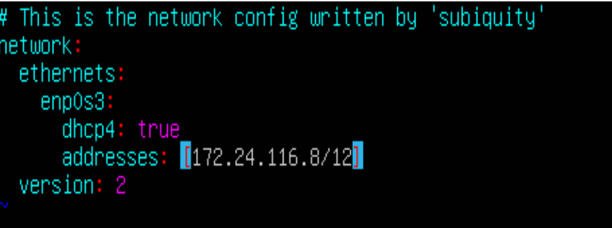
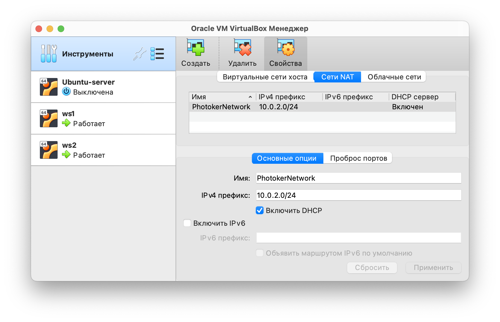
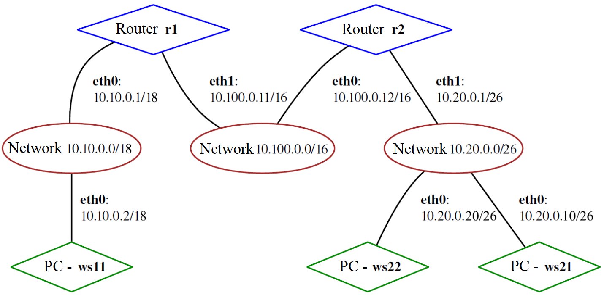
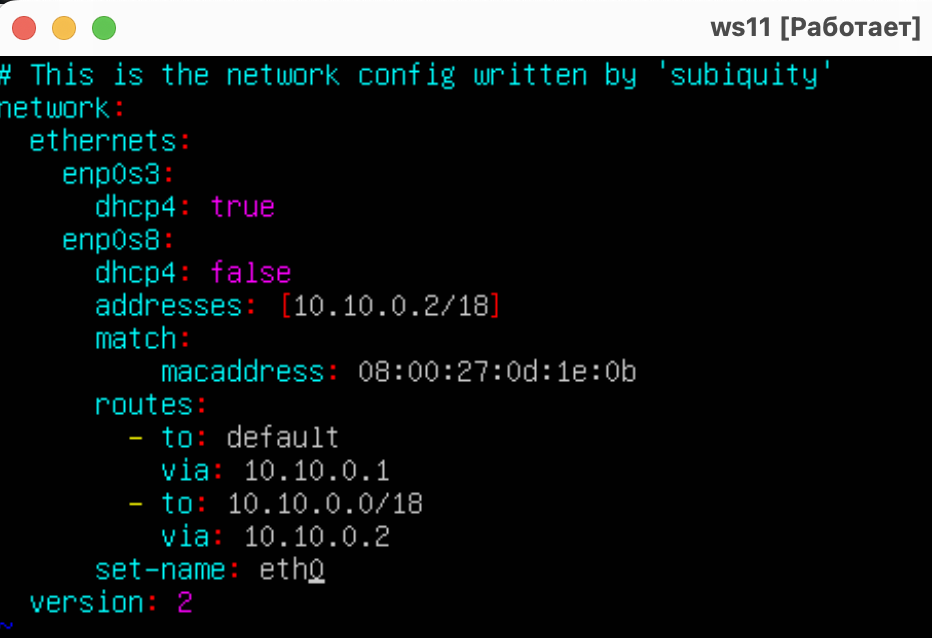
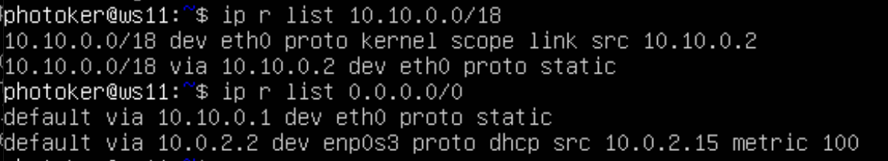
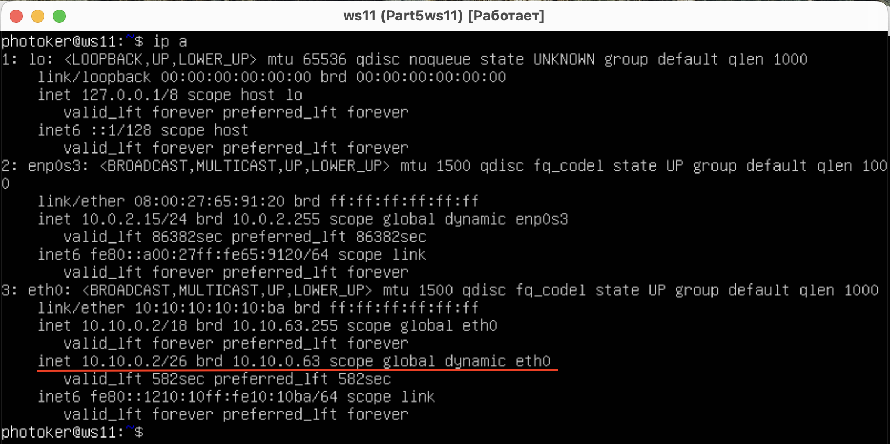
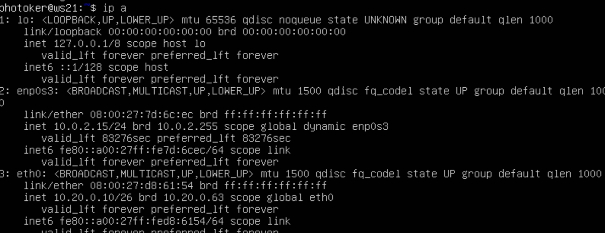

## Part 1. Инструмент ipcalc
- ``Устанавливаем ipcalc командой  - sudo apt install ipcalc``
  

### 1.1. Сети и маски

- адрес сети 192.167.38.54/13 можно посмотреть вбив команду  **ipcalc 192.167.38.54/13**
  

- перевод маски 255.255.255.0 в префиксную (/24) и двоичную запись:
  
- /15 в обычную и двоичную:
  
- 11111111.11111111.11111111.11110000 в обычную - 255.255.255.240 и префиксную - /28:
  

- минимальный и максимальный хост (Минимальный и максимальный хост - это первый и последний IP-адрес в диапазоне адресов хостов в определенной подсети. 
Они могут быть вычислены на основе IP-адреса сети и маски подсети.) в сети 12.167.38.4 при масках: 
  - /8:
    
  - 11111111.11111111.00000000.00000000:
    
    Видим сообщение об ошибке, однако данную маску можно перевести в слэш формат 11111111.11111111.00000000.00000000 = /16, тогда вывод будет следующим:
    
  - 255.255.254.0:
    
  - /4:
    
  
### 1.2. localhost

- К приложению работающему на localhost можно обратиться только с ip адреса относящемуся к loopback (петле обратной связи), таким образом обратиться можно будет с адресов 127.0.0.2, 127.1.0.1, а с адресов 194.34.23.100, 128.0.0.1 этого сделать не получится. Подтверждение этому мы можем получить в строчке **Hosts/Net**, по выполнению команды ipcalc, для адрсесов с которых можно обратиться к localhost значение будет содержать Loopback.
  - можно обратиться:
  
  
  - нельзя обратиться:
  
  
  
Термин "Hosts/Net Class" обычно связан с классификацией сетей на основе количества хостов, которые могут быть подключены к каждой сети.
В классической адресации IPv4 сети делятся на классы (Class A, B, C, D и E), каждый из которых имеет определенное количество бит, выделенных для идентификации сети и хостов. Количество доступных хостов в каждом классе определяется длиной адреса подсети (subnet mask) и зависит от того, сколько бит в адресе зарезервированы для идентификации сети и хостов.
Классы сетей и количество доступных хостов в каждом классе выглядят следующим образом:
  - Class A: Используется для больших сетей. Первый октет адреса (8 бит) зарезервирован для идентификации сети, оставшиеся три октета (24 бита) - для идентификации хостов. Количество доступных хостов - около 16 миллионов.

  - Class B: Используется для средних сетей. Первые два октета адреса (16 бит) зарезервированы для идентификации сети, оставшиеся два октета (16 бит) - для идентификации хостов. Количество доступных хостов - около 65 тысяч.

  - Class C: Используется для малых сетей. Первые три октета адреса (24 бита) зарезервированы для идентификации сети, последний октет (8 бит) - для идентификации хостов. Количество доступных хостов - около 254.

  - Class D и Class E: Зарезервированы для специальных целей и не используются для идентификации хостов в обычных сетях.

### 1.3. Диапазоны и сегменты сетей

 ```Публичный IP адрес - называется IP адрес, который используется для выхода в Интернет. Частный IP адрес - адреса, используемые в локальных сетях (не может быть напрямую подключен к Интернету). К публичным относятся следующие IP адреса: 134.43.0.2, 172.0.2.1, 192.172.0.1, 172.68.0.2, 192.169.168.1:```
 
 
 
 
```Частный адрес сети (Private Network Address) - это диапазон IP-адресов, зарезервированных для использования в частных сетях, таких как домашние сети или офисные локальные сети. Частные адреса не маршрутизируются в интернете и не уникальны глобально, поэтому их можно использовать внутри локальных сетей без конфликта с другими устройствами в интернете. К частным относятся следующие IP адреса: 10.0.0.45, 192.168.4.2, 172.20.250.4, 172.16.255.255, 10.10.10.10:```


- Узнаем какие из перечисленных IP адресов шлюза возможны у сети 10.10.0.0/18: 10.0.0.1, 10.10.0.2, 10.10.10.10, 10.10.100.1, 10.10.1.255 просмотрев значения **HostMin/HostMax**:
  
  ```Отсюда делаем вывод что возможные адреса шлюза для данной сети - 10.10.0.2, 10.10.10.10, 10.10.1.255```

## Part 2. Статическая маршрутизация между двумя машинами

- Поднять две виртуальные машины (далее -- ws1 и ws2)

- С помощью команды ip a посмотреть существующие сетевые интерфейсы на обеих машинах:
  
  
```inet - указывает на IPv4-адрес интерфейса. inet6 - указывает на IPv6-адрес интерфейса.link/ether - указывает на MAC-адрес (физический адрес) интерфейса. valid_lft - время жизни(в секундах) для назначенного адреса. scope - указывает на область видимости адреса (link,global, host).brd - указывает на широковещательный адрес интерфейса. lo - интерфейс обратной петли (loopback), который используется для локального доступа к устройству. eth0 - имя сетевого интерфейса (может быть другим на вашей системе). state - состояние интерфейса (UP - активен, DOWN - отключен). mtu - размер MTU (максимального передаваемого блока данных) интерфейса. qlen - размер очереди пакетов (буфера) интерфейса. link/loopback - указывает на тип интерфейса (loopback - обратная петля, ethernet - Ethernet-интерфейс и т.д.).```

- Описать сетевой интерфейс, соответствующий внутренней сети, на обеих машинах и задать следующие адреса и маски: ws1 - 192.168.100.10, маска /16, ws2 - 172.24.116.8, маска /12:
  `` Для этого используем команду  sudo vim /etc/netplan/00-installer-config.yaml:`` 
  - ws1:
  
  - ws2:
  
- Выполнить команду netplan apply для перезапуска сервиса сети:
  
  
 ### 2.1. Добавление статического маршрута вручную
- Настроим виртуальные машины для дальнешей работы, создадим новую сеть PhotokerNet (Инструменты - Сеть - Сети NAT).
`` Сеть NAT (Network Address Translation) - это метод перевода адресов сети, который используется для перевода IP-адресов и портов между двумя различными сетями. NAT часто применяется для обеспечения доступа к интернету для устройств в локальных сетях. Основная задача сети NAT состоит в переводе IP-адресов и портов между двумя сетями: внешней сетью (например, интернетом) и локальной сетью (например, домашней или офисной сетью). Это позволяет нескольким устройствам в локальной сети использовать один общедоступный IP-адрес для доступа в интернет. Когда устройство из локальной сети отправляет пакет данных в интернет, сеть NAT заменяет его локальный IP-адрес и порт на свой внешний IP-адрес и порт. Это делается для того, чтобы пакеты, возвращающиеся из интернета, могли быть корректно перенаправлены обратно на правильное устройство в локальной сети на основе информации о соответствующем переводе адреса и порта:``
  
- Убедимся что виртуальные машины работают в этой сети:
  
  
- Добавить статический маршрут от одной машины до другой и обратно при помощи команды вида ip r add:
  
- Пропинговать соединение между машинами:
  
  
### 2.2. Добавление статического маршрута с сохранением

- Добавить статический маршрут от одной машины до другой с помощью файла etc/netplan/00-installer-config.yaml:
  
- Пропинговать соединение между машинами:
  

- После перезагрузки обе машины также пингуются: 
  

## Part 3. Утилита iperf3

### 3.1. Скорость соединения

**Перевести и записать в отчёт: 8 Mbps в MB/s, 100 MB/s в Kbps, 1 Gbps в Mbps**

- 8 Mbps (мегабит в секуду) = 1 MB/s (мегабайт в секунду)
- 100 MB/s (мегабайт в секунду) = 800 000 Kbps (килобит в секунду)
- 1 Gbps (гигабит в секунду) = 1 000 Mbps (мегабит в секунду)
  
### 3.2. Утилита iperf3

iperf3 - это инструмент командной строки для тестирования пропускной способности сети. Он используется для измерения скорости передачи данных между двумя узлами в сети.

iperf3 поддерживает TCP и UDP протоколы и позволяет проверить пропускную способность сети, задержку, потерю пакетов и другие параметры. Он может быть полезен при настройке и оптимизации сетей, а также при выполнении диагностики сетевых проблем.

Для использования iperf3 необходимо установить его на две машины - одну в качестве сервера, а другую в качестве клиента. Затем можно запустить тест, указав режим работы (клиент или сервер), IP-адрес или имя хоста сервера и опциональные параметры, такие как продолжительность теста, порт и т.д.

**Измерить скорость соединения между ws1 и ws2**:

- На ws1 запускаем iperf3 в режиме сервера: iperf3 -s:


- Теперь к ws1 можно подключаться по порту 5201 клиентам iperf3:
На клиенте (ws2) запускаем iperf3 с указанием IP сервера к которому подключаемся iperf3 -c 192.168.120.100 -R
- с — адрес сервера с запущенным iperf3 на 5201 порту
- R — режим Reverse Mode для тестирования входящей скорости


- Cреднее значение пропускной способности между двумя виртуальными машинами ws1 и ws2 при передачи 2.71 GBytes (Гбайт) составила 2.33 GBits/sec (Гбит/сек).

## Part 4. Сетевой экран

- Сетевой экран (англ. firewall) - это программно-аппаратное устройство, которое используется для обеспечения безопасности компьютерных сетей. Он выполняет функцию фильтрации трафика, контролируя и регулируя поток данных между различными сегментами сети или между сетью и внешней средой, такой как интернет.

### 4.1. Утилита iptables

Утилита iptables - это инструмент командной строки в операционных системах Linux, который предоставляет интерфейс для управления фильтрацией пакетов и межсетевым экраном (firewall) в ядре Linux. Она позволяет администраторам настраивать правила и политики безопасности для контроля сетевого трафика.

iptables использует набор правил, называемых таблицами, для принятия решений о том, как обрабатывать пакеты данных. Он может выполнять различные действия с пакетами, такие как разрешение или блокирование передачи данных, перенаправление пакетов на другие порты или устройства, изменение адреса или порта назначения и многое другое.

Основные таблицы iptables включают:

- Таблица filter: используется для фильтрации пакетов и принятия решений о пропуске или блокировке пакетов на основе определенных правил.

- Таблица nat: используется для изменения сетевых адресов и портов в пакетах, особенно при настройке маскарадинга (NAT) или перенаправления портов (port forwarding).

- Таблица mangle: позволяет изменять определенные поля заголовков пакетов, такие как TOS (Type of Service), TTL (Time to Live) и другие.

- Таблица raw: предоставляет возможность настраивать правила безопасности на более низком уровне и обрабатывать пакеты до их прохождения через таблицу conntrack.

**Создать файл /etc/firewall.sh, имитирующий фаерволл, на ws1 и ws2:**

Утилита iptables в Linux поддерживает множество ключей и опций для настройки правил фильтрации и межсетевого экрана. Вот некоторые из наиболее часто используемых ключей iptables:

- -A или --append: добавляет правило в конец указанной цепочки.
- -D или --delete: удаляет указанное правило из цепочки.
- -I или --insert: вставляет правило в указанную позицию в цепочке.
- -L или --list: выводит список правил в указанной цепочке или всех цепочках.
- -P или --policy: устанавливает политику по умолчанию для указанной цепочки.
- -F или --flush: очищает указанную цепочку, удаляя все правила.
- -s или --source: определяет исходный IP-адрес или сеть пакета.
- -d или --destination: определяет целевой IP-адрес или сеть пакета.
- -p или --protocol: указывает протокол пакета (например, tcp, udp, icmp).
- -j или --jump: указывает действие, которое следует предпринять с пакетом (например, ACCEPT, DROP, REJECT).
- -i или --in-interface: определяет входной сетевой интерфейс пакета.
- -o или --out-interface: определяет выходной сетевой интерфейс пакета.
- -m или --match: используется для применения дополнительных модулей сопоставления пакетов (например, state, multiport).

- 1) на ws1 применить стратегию когда в начале пишется запрещающее правило, а в конце пишется разрешающее правило (это касается пунктов 4 и 5)

- 2) на ws2 применить стратегию когда в начале пишется разрешающее правило, а в конце пишется запрещающее правило (это касается пунктов 4 и 5)

- 3) открыть на машинах доступ для порта 22 (ssh) и порта 80 (http)

- 4) запретить echo reply (машина не должна "пинговаться”, т.е. должна быть блокировка на OUTPUT)

- 5) разрешить echo reply (машина должна "пинговаться")


**апустить файлы на обеих машинах командами chmod +x /etc/firewall.sh и /etc/firewall.sh:**


- Скрипт для ws1 применяет стратегию, когда в начале файла указано запрещающее правило (iptables -P OUTPUT DROP), а в конце файла разрешающее правило (iptables -P INPUT ACCEPT). Таким образом, все исходящие соединения будут запрещены, но все входящие соединения разрешены.
- Скрипт для ws2 применяет стратегию, когда в начале файла указано разрешающее правило (iptables -P OUTPUT ACCEPT), а в конце файла запрещающее правило (iptables -P INPUT DROP). Это означает, что все исходящие соединения разрешены, но все входящие соединения будут запрещены.

### 4.2. Утилита nmap

**Установим утилиту с помощью команды sudo apt install nmap**

**Командой ping найти машину, которая не "пингуется", после чего утилитой nmap показать, что хост машины запущен. Проверка: в выводе nmap должно быть сказано: Host is up**

- ping ws2 c ws1:
  

- ping ws1 c ws2:


- Как видно не пингуется ws1, поскольку для нее были прописаны соответствующие правила, заприщающие входящие соединения

- **Сохранить дампы образов виртуальных машин**:


## Part 5. Статическая маршрутизация сети

**Поднять пять виртуальных машин (3 рабочие станции (ws11, ws21, ws22) и 2 роутера (r1, r2))**



- r1:


- r2:

  

- ws11:
  
  

- ws21:

  

- ws22:

  

**Настроить конфигурации машин в etc/netplan/00-installer-config.yaml согласно сети на рисунке.**


- на всех машинах была применена команда ***sudo netplan apply**

- вывод команды **ip -4 a**
  
  - для r1:
    
  
  - для ws11:
    
  
  - для ws21:
    
  - для ws22:
    

  
  - для r2:
    
  
- Ping ws22 с ws21:
  

- Ping r1 с ws11:
  

### 5.2. Включение переадресации IP-адресов

- Для включения временной переадресации IP выполняем команду на роутерах: sudo sysctl -w net.ipv4.ip_forward=1, при таком подходе переадресация не будет работать после перезагрузки системы:


- Для включения IP-переадресации на постоянной основе добавляем в файл /etc/sysctl.conf следующую строку: net.ipv4.ip_forward = 1


- Перезагружаем и выполняем команду sysctl net.ipv4.ip_forward для проверки: 
  

### 5.3. Установка маршрута по-умолчанию

- Добавляем маршрут по-умолчанию в файле конфигураций etc/netplan/00-installer-config.yaml.Для этого добавить default перед IP роутера в файле конфигураций
  
  
  
  


- Используем **ip r** чтобы показать, что добавился маршрут в таблицу маршрутизации:
 
  
  
  

- Пинг с ws11 роутер r2 и показать на r2, что пинг доходит. Для этого использована команда tcpdump -tn -i eth0:
  


 Перехватываем трафик с помощью команды tcpdump -tn -i eth0 и видим, что пинг доходит:

  

### 5.4. Добавление статических маршрутов

- Добавить в роутеры r1 и r2 статические маршруты в файле конфигураций:
  
  
  

- Вызвать ip r и показать таблицы с маршрутами на обоих роутерах. Пример таблицы на r1:
  
  
  

  
- Запустить команды на ws11:
  - ip r list 10.10.0.0/[маска сети]
  - ip r list 0.0.0.0/0:
  

- IP-адрес 0.0.0.0 означает «эта сеть», но для использования в традиционном смысле этот адрес непригоден. Это похоже на ссылку: «Вставьте сюда адрес», или, в зависимости от контекста, «без конкретного адреса назначения». Он действует как резервный, пока не будет назначен действительный маршрутизируемый IP-адрес. Вариант использования IP-адреса 0.0.0.0 в качестве статического маршрута по умолчанию означает, что в таблице маршрутизации не указан конкретный адрес в качестве следующего перехода на пути пакета к его конечному получателю. Когда маршрут по умолчанию используется с маской подсети 0.0.0.0, он соответствует любому адресу.

### 5.5. Построение списка маршрутизаторов

- Запустить на r1 команду дампа tcpdump -tnv -i eth0:
  
  

- При помощи утилиты traceroute построить список маршрутизаторов на пути от ws11 до ws21:
  
  

- Процесс работы traceroute следующий:

Когда вы запускаете traceroute, он отправляет серию пакетов данных (обычно UDP) с инкрементирующимся значением TTL (Time to Live) в заголовке IP. TTL указывает, сколько прыжков (хопов) пакет может сделать, прежде чем будет отброшен.

Первый пакет отправляется с TTL равным 1. Когда пакет попадает на первый маршрутизатор (хоп) в сети, его TTL уменьшается на 1. Если TTL достигает нуля, маршрутизатор отбрасывает пакет и отправляет обратно сообщение об ошибке "Time Exceeded" (Время истекло) отправителю traceroute.

Отправитель traceroute получает сообщение "Time Exceeded" и записывает IP-адрес маршрутизатора, от которого пришло сообщение.

Затем traceroute отправляет следующий пакет с TTL, увеличенным на 1, чтобы попасть на следующий хоп в маршруте. Процесс повторяется для каждого хопа, пока пакеты не достигнут назначения (получателя).

Когда пакет достигает получателя, traceroute получает сообщение "Destination Reached" (Достигнуто назначение) и завершает свою работу.

В результате работы traceroute вы получаете список IP-адресов маршрутизаторов, через которые проходят пакеты, а также время, затраченное на достижение каждого хопа (RTT - Round-Trip Time).

### 5.6. Использование протокола ICMP при маршрутизации

Протокол ICMP (Internet Control Message Protocol) является одним из основных протоколов интернета. Он работает поверх протокола IP (Internet Protocol) и предназначен для передачи контрольных сообщений, используемых для диагностики и управления сетью.

Некоторые основные функции протокола ICMP:

- Отправка сообщений об ошибках: ICMP используется для отправки сообщений об ошибках, связанных с доставкой IP-пакетов. Например, когда пакет не может быть доставлен, ICMP может сгенерировать сообщение об ошибке, чтобы оповестить отправителя о проблеме.

- Определение доступности узлов: ICMP может быть использован для проверки доступности удаленных узлов с помощью команды ping. При выполнении ping ICMP-сообщения типа Echo Request (запрос эха) отправляются на удаленный узел, и если удаленный узел отвечает ICMP-сообщением типа Echo Reply (ответ на запрос эха), это указывает на то, что узел доступен.

- Реализация трассировки маршрута: ICMP также используется для выполнения трассировки маршрута с помощью утилиты traceroute. Она отправляет серию ICMP-сообщений с увеличающимся значением поля TTL, чтобы отслеживать путь, который пакеты проходят от отправителя к получателю.

- Отправка сообщений контроля и управления: ICMP может быть использован для отправки различных сообщений контроля и управления сетью, таких как сообщения об исчерпании времени жизни пакета, сообщения о переполнении буфера и т.д.

- **Запустить на r1 перехват сетевого трафика, проходящего через eth0 с помощью команды tcpdump -n -i eth0 icmp**:

  

- **Пропинговать с ws11 несуществующий IP (например, 10.30.0.111) с помощью команды ping -c 1 10.30.0.111**:
  
  

- Команда tcpdump -n -i eth0 icmp запускает утилиту tcpdump на интерфейсе eth0 в режиме перехвата ICMP трафика. Опция -n отключает преобразование IP-адресов и портов в их имена, а опция -i eth0 указывает на интерфейс, на котором будет выполняться перехват.

- При перехвате tcpdump можно увидить вывод в tcpdump, отображающий ICMP пакеты, проходящие через интерфейс eth0 на машине r1. Можно увидеть информацию об отправленных ICMP запросах и полученных ICMP ответах, если таковые имеются.

- Сохранение дампов всех машин:

   

## Part 6. Динамическая настройка IP с помощью DHCP


Для r2 настроить в файле /etc/dhcp/dhcpd.conf конфигурацию службы DHCP:
- **sudo apt install isc-dhcp-server**
- 1) указать адрес маршрутизатора по-умолчанию, DNS-сервер и адрес внутренней сети. Отредактированный файл для r2:
  
  

- 2) в файле resolv.conf прописать nameserver 8.8.8.8:
  
  

- Перезагрузить службу DHCP командой systemctl restart isc-dhcp-server. Машину ws21 перезагрузить при помощи reboot и через **ip a** показать, что она получила адрес. 
- Также пропинговать ws22 с ws21:

  
  

- Указать MAC адрес у ws11, для этого в etc/netplan/00-installer-config.yaml надо добавить строки: macaddress: 10:10:10:10:10:BA, dhcp4: true:

  
  

- Для r1 настроить аналогично r2, но сделать выдачу адресов с жесткой привязкой к MAC-адресу (ws11). Провести аналогичные тесты
- Содержание файла /etc/dhcp/dhcpd.conf для r1 с конфигурацией службы DHCP:
  
  

- Содержание файла /etc/resolf.conf для r1 с конфигурацией службы DHCP:
  
  

- Перезагрузка необходимых служб:

 

- Машину ws11 перезагрузить при помощи reboot и через ip a показать, что она получила адрес.

  

- Пингуем ws11 c ws21 и ws22:

  
  

- Запрос обновления ip адреса с ws21
- Через **ip a** показываем текущий адрес ws21:

  

- Принудительного освобождаем IP-адрес DHCP-клиента с помощью команды sudo dhclient -r

- Получаем новый IP-адрес с помощью DHCP с помощью команды sudo dhclient -v и через ip a показываем что адрес ws21 сменился:

  

- В части 6 были использованы следующие опции DHCP протокола:
  - option routers ip-address [, ip-address...]; - адреса шлюзов для клиентской сети Маршрутизаторы должны быть перечислены в порядке предпочтительности.
  - option domain-name-servers ip-address [, ip-address...]; - Список DNS серверов доступных клиенту. Сервера должны быть перечислены в порядке предпочтительности.

- Сохранить дампы образов виртуальных машин:

  

## Part 7. NAT

- Для работы с сервером apache2, установим его на машины r1, r2 и ws22 c помощью команды **sudo apt install apache2**

- В файле /etc/apache2/ports.conf на ws22 и r1 изменить строку Listen 80 на Listen 0.0.0.0:80, то есть сделать сервер Apache2 общедоступным:

  
  

- Запустить веб-сервер Apache командой service apache2 start на ws22 и r1:

  
  

- Добавить в фаервол, созданный по аналогии с фаерволом из Части 4, на r2 следующие правила:
  1) удаление правил в таблице filter - iptables -F
  2) удаление правил в таблице "NAT" - iptables -F -t nat
  3) отбрасывать все маршрутизируемые пакеты - iptables --policy FORWARD DROP
  
  

  Запускать файл также, как в Части 4 - **sudo chmod +x /etc/firewall.sh* *sudo bash /etc/firewall.sh**

  

- Проверить соединение между ws22 и r1 командой ping:

  
  

  Роутер не пингуется, поскольку это прописано в правилах нашего firewall'а, так что все работает как нужно.

- Добавить в файл ещё одно правило:
  - 4) разрешить маршрутизацию всех пакетов протокола ICMP:
  

- Также запускаем скрипт и пробуем пропинговать r1 c ws22:
  
  
  

- Теперь пинг проходит успешно, как и должно быть

- Добавить в файл ещё два правила:
  - 5) включить SNAT, а именно маскирование всех локальных ip из локальной сети, находящейся за r2 (по обозначениям из Части 5 - сеть 10.20.0.0)
  - 6) включить DNAT на 8080 порт машины r2 и добавить к веб-серверу Apache, запущенному на ws22, доступ извне сети

  

  - Значения использованных опций:
    - t - указывает на используемую таблицу;
    - p - указывает протокол, такие как tcp, udp, udplite и другие, поддерживаемые системой, ознакомиться со списком можно в файле /etc/
    protocols;
    - m - подключает указанный модуль;
    - s - указывает адрес источника пакета, в качестве значения можно указать как один IP-адрес, так и диапазон;
    - i - задает входящий сетевой интерфейс;
    - o - указывает исходящий сетевой интерфейс;
    - --dport - порт получателя пакета;
    - DNAT — подменяет адрес получателя в заголовке IP-пакета, основное применение — предоставление доступа к сервисам снаружи, 
    находящимся внутри сети;
    - SNAT — служит для преобразования сетевых адресов, применимо, когда за сервером находятся машины, которым необходимо предоставить 
    доступ в Интернет, при этом от провайдера имеется статический IP-адрес.
    - NAT — это аббревиатура для преобразования сетевых адресов. NAT возникает при изменении одного из IP-адресов в заголовке IP-пакета, 
    т. е. IP-адреса источника (source-addr) или IP-адреса назначения (dest-addr).

- Запускаем скрипт аналогичным образом
  

- Проверить соединение по TCP для SNAT, для этого с ws22 подключиться к серверу Apache на r1 командой telnet [адрес] [порт]:
  
  

- Убедиться в подмене ip можно запустив tcpdump на r1, при обращении с ws22 в выводе дампа отображается ip r2:
  
  

- Проверить соединение по TCP для DNAT, для этого с r1 подключиться к серверу Apache на ws22 командой telnet (обращаться по адресу r2 и порту 8080):
  
  

- Актуальные дампы системы:
  
  

## Part 8. Дополнительно. Знакомство с SSH Tunnels

- Запустить на r2 фаервол с правилами из Части 7:

  


- Редактируем файл etc/ssh/sshd_config ws22:
  
  

- Запустить веб-сервер Apache на ws22 только на localhost (то есть в файле /etc/apache2/ports.conf изменить строку Listen 80 на Listen localhost:80):

  
  

- Local TCP forwarding (также известен как локальное перенаправление портов) - это метод использования SSH для перенаправления трафика между клиентской машиной и сервером SSH. Этот метод позволяет клиентской машине использовать SSH-соединение как "прокси-сервер" для обращения к удаленным ресурсам.
- Воспользоваться Local TCP forwarding с ws21 до ws22, чтобы получить доступ к веб-серверу на ws22 с ws21, используем команду **ssh -L 8888:localhost:80 photoker@10.20.0.20**:

  

- Для проверки, сработало ли подключение в обоих предыдущих пунктах, перейдите во второй терминал (например, клавишами Alt + F2) и выполните команду:
telnet 127.0.0.1 [локальный порт]:

  

- Сервер на ws22 прислал сообщение "bad request", значит, подключение сработало

- **Воспользоваться Remote TCP forwarding c ws11 до ws22, чтобы получить доступ к веб-серверу на ws22 с ws11**:

- Из-за того что на роутере r2 настроен firewall, подключиться к серверу Apache на машине ws22 с помощью команды ssh -L, с машины ws11, не получится (роутер r2 не пропустит команду). В этом случае необходимо воспользоваться командой ssh -R. Выполнить её необходимо на машине ws22. Это выполняется за несколько шагов:
  - Так как в правилах iptables на r2 есть разрешающее правило цепочки FORWARD для установленных соединений (ESTABLISHED), необходимо с машины ws11 подсоедениться по ssh сначала к r2 командой ssh 10.100.0.12, далее к ws22 ssh 10.20.0.20 Находясь физически на ws11 подключаемся с ws22 к ws11

  

  - как видно на скриншоте из под физического запуска ws11 в терминале мы управляем r2
  - теперь выполним команду **ssh 10.20.0.20**:

  

  - На машине ws11 осуществим проброс туннеля с машины ws22 на машину ws11 с помощью ssh -R:

  

  - Для проверки, сработало ли подключение, перейдите во второй терминал (например, клавишами Alt + F2) и выполните команду:telnet 127.0.0.1 [локальный порт]:

  

  - Ответ возвращается, так что все работает так как нужно.

  - Делаем дампы образов виртуалок:

  